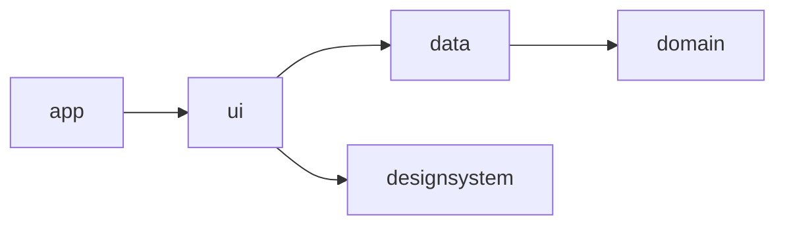
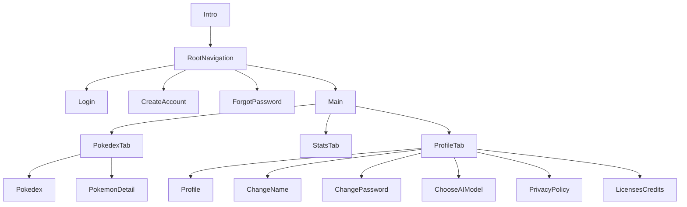
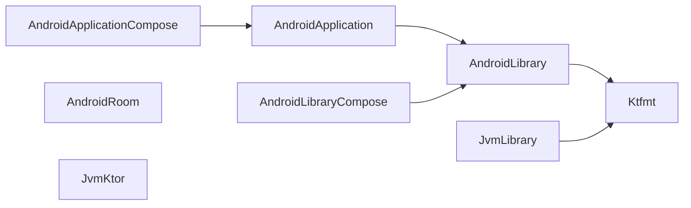

# Architecture

**Snapdex** is a modern Android app built with Jetpack Compose. It serves as a production-quality showcase of scalable architecture, modular design, and practical offline-first strategies. This guide outlines the technical decisions and structural patterns used in the app.

## 1. Architectural Principles

When it comes to architecture, I strongly believe in **minimalism over over-engineering**.

I don’t start with rigid layers or textbook abstractions — I let structure emerge naturally as the app grows. For me, architecture should serve the team and the product, not just theoretical purity.

I often see Clean Architecture applied too dogmatically, where developers mistake the core intent behind the author's words as "there's only one way to have a clean architecture", or SRP == "one function per file, function should be extremely small". I couldn't agree less with that thinking. I prefer to understand the intent behind these principles and then adapt them pragmatically to my use case. 

That said, Snapdex is a portfolio project, so I intentionally leaned into a more structured, scalable approach to demonstrate what I’d do on a production team. If this were just a small personal app, I would have kept things simple.

### Layering in Snapdex
Snapdex uses a modular take on Clean Architecture to enforce separation of concerns and improve testability and scalability:

- Domain Layer – Business logic and domain models
- Data Layer – Local persistence with Room and remote access with Firestore
- UI Layer – Jetpack Compose screens and ViewModels built around the MVI pattern
- App Layer – Entry point and dependency wiring

Each layer lives in its own Gradle module, and convention plugins help standardize configuration across modules.

## 2. UI Architecture

Snapdex is built using the **Model–View–Intent (MVI)** pattern to create a UI that’s both **predictable** and **testable**.

### Why MVI?

While **MVVM** is a widely used and perfectly valid pattern — one I’ve used myself since the early days of WPF development back in 2006 — I find **MVI offers a more deterministic and maintainable approach**, especially as complexity grows.

My preference for MVI also comes from my background with **Fabulous**, the open-source framework I co-created. It’s based on **MVU (Model–View–Update)**, which shares the same core concepts as MVI but comes from the F# ecosystem. What I’ve always appreciated about this pattern is its **state machine nature**: everything that happens in the UI flows through a single stream of intent-driven updates. This design naturally avoids many common issues related to concurrency, race conditions, and inconsistent state.

MVI encourages **explicitness** and **clear separation of concerns**:
- The **State** file holds all the business-related data that the UI depends on.
- The **Actions** file defines everything the user can trigger.
- The **Events** file represents one-off effects that the app wants to notify the UI about (e.g. navigation, messages).

One important design decision I made in Snapdex is to **keep the ViewModel and State focused purely on business-related data**. Anything related to UI presentation — like animation states, opacity, or navigation — is handled inside the UI itself. In other words, **the UI is responsible for UI**. This separation avoids mixing concerns and keeps the logic layer clean and easier to maintain.

Compared to MVVM, MVI can feel more demanding to scale — but I actually see that as a feature. It exposes when a screen is doing too much and nudges you toward better separation of concerns. That trade-off has worked really well in Snapdex, and I’d make the same choice again for apps with similar complexity.

### UI Structure in Snapdex

- **ScreenRoot**: The entry point of each screen. It connects to the `ViewModel`, observes the `State`, and handles `Events`. It also manages navigation.
- **Screen**: A purely functional composable that takes `State` and callbacks such as `onAction` as input and renders the UI. It knows nothing about the ViewModel or navigation. This makes it easy to test and preview in isolation.
- **ViewModel**: Acts as the logic hub. It exposes an immutable `State`, accepts user `Actions`, and emits one-time `Events`.
- **Components**: Stateless, reusable composables that encapsulate styling and interactions.
- **State**: An immutable snapshot of all the **business-related** data the screen needs to render.
- **Actions**: Represent user intentions — button taps, text input, etc.
- **Events**: One-time effects like navigation, snackbars, or dialogs.

### Navigation

Snapdex uses Jetpack Compose Navigation, with a clean separation between screens and logic:

- The **intro screen** is shown only once (`hasSeenIntro`)
- The **authentication flow** is skipped if the user is already logged in (`currentUser != null`)
- The **main flow** is split into three persistent tabs: **Pokedex**, **Stats**, and **Profile**
- Navigation is handled within each tab independently, keeping navigation scoped and easy to manage

## 3. Design System

The app includes a custom **Design System module**:

- Inspired by **Material 3**
- Designed to match custom Figma designs
- All components are **portable and reusable** in other Compose apps
- Enforces consistent typography, colors, shapes, spacing, and interactions

This encourages UI consistency and accelerates development.

## 4. Data Management

Snapdex is built around an **offline-first** philosophy. All core data is persisted locally and synced to the cloud as needed.

### Stack

- **Room** for local persistence
- **Firestore** for remote storage
- **Repositories** abstract local and remote logic
- **Domain services** coordinate business operations across sources

### Sync Strategy

- **Best-effort sync** from local to remote when performing create/update/delete operations
- **Just-in-time full sync** triggered on login or app open
- **No WorkManager** used: sync logic is simple enough to avoid background schedulers

## 5. Authentication & Security

Snapdex uses:

- **Firebase Authentication** for user accounts
- **Encrypted local storage** to store the OpenAI API key (used for image captioning features)

Secrets are managed securely and excluded from version control.

## 6. Modularization

The app is split into Gradle modules to ensure clean boundaries and fast builds.

| Module         | Purpose                          | Convention Plugins                                                                 |
|----------------|----------------------------------|-------------------------------------------------------------------------------------|
| `app`          | App entry point                  | `AndroidApplicationCompose`                                                        |
| `ui`           | Screens, ViewModels, navigation  | `AndroidLibraryComposeConventionPlugin`                                            |
| `designsystem` | Reusable UI components           | `AndroidLibraryComposeConventionPlugin`                                            |
| `data`         | Room, Firestore, repositories    | `AndroidLibrary`, `AndroidRoom`, `JvmKtor`                                         |
| `domain`       | Business logic, models           | `JvmLibrary`                                                                       |

### Convention Plugin Structure

Each plugin standardizes dependencies, settings, and formatting per module type.

## 7. Build & Tooling

Snapdex integrates modern tooling to support development, quality, and distribution.

### GitHub Actions

- Linting and formatting
- Build checks
- Unit test runner

### Code Style

- **ktfmt** for formatting
- Pre-commit hooks encouraged to enforce consistency

### Secrets Management

- Stored in `local.properties`
- Kept out of version control via `.gitignore`

### App Distribution

- **Firebase App Distribution** for tester access
- **Play Store** for production deployment

## 8. Internationalization

Snapdex uses standard Android resource strings and supports localization out of the box. All user-facing strings are externalized for easy translation.

## 9. Why This Architecture?

Snapdex is not just a sample — it’s designed for **real-world quality**:

- Scales well for larger teams
- Fully testable (unit + integration tests ready)
- Highly maintainable due to clear separation of concerns
- Extensible for future features like AI-based recognition or remote backup