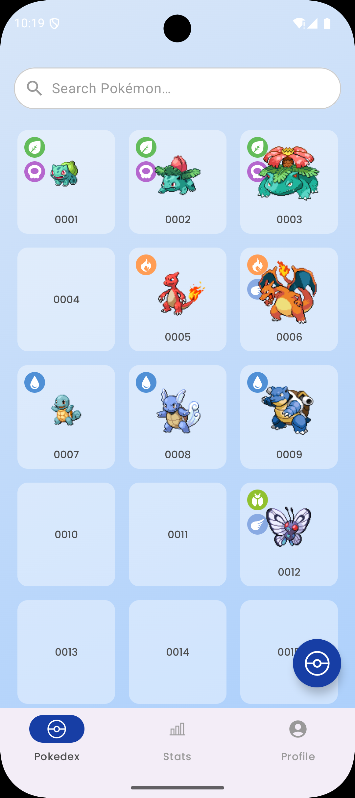
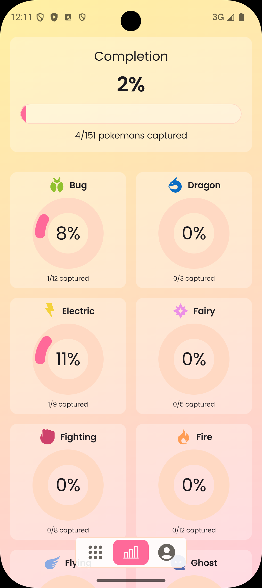
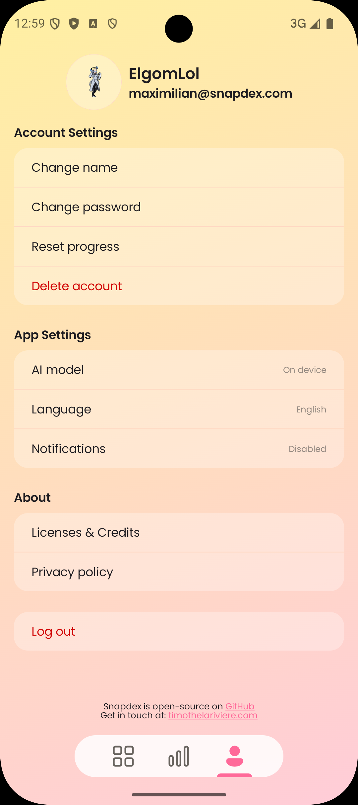
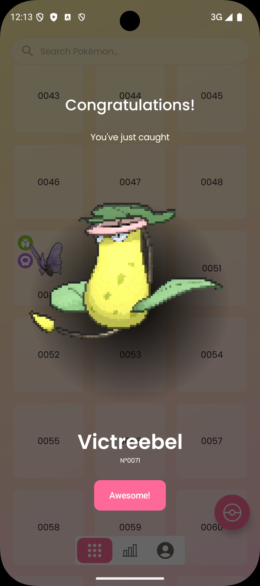
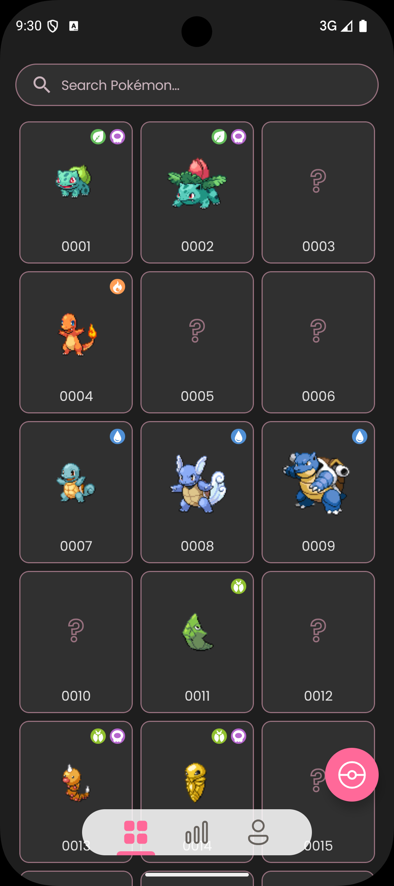
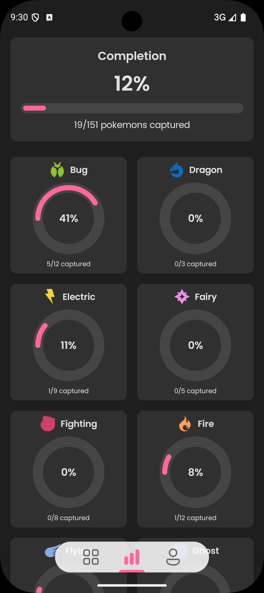
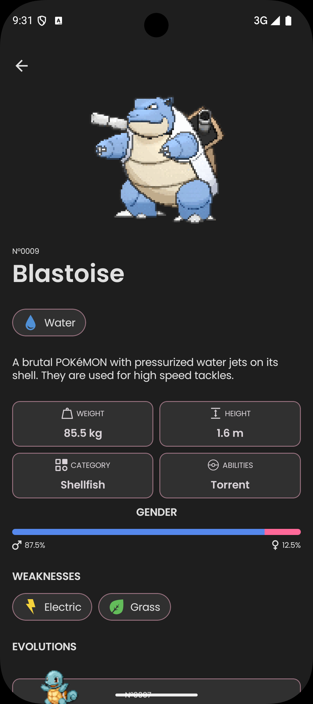

# Snapdex — Compose Edition

[](https://play.google.com/store/apps/details?id=com.kanoyatech.snapdex)

**Snapdex** is a modern Android app built with **Jetpack Compose** and **Kotlin 2.0**, inspired by the idea of a personal Pokédex. Users can snap photos of Pokémon-themed merchandise (like plushes, trading cards, or figurines) and use AI to identify and catalog them in their collection.

While playful in concept, **Snapdex is a serious, production-quality showcase** of mobile architecture, design systems, offline-first strategies, and integration with real-world features like camera, authentication, and analytics.

> ✨ Looking for the iOS version? Check out [Snapdex – SwiftUI Edition](https://github.com/TimLariviere/Snapdex-SwiftUI)

## 🎯 Why I Built Snapdex

Snapdex started as a personal project to explore **Jetpack Compose** and demonstrate how I approach mobile development as a Senior/Staff-level engineer.

It also served as a way to translate my experience from .NET MAUI and Xamarin — where I’ve built production apps using patterns like MVVM and MVU (via Fabulous, which I co-created) — into the Compose ecosystem. The architectural foundations remain the same: clean separation of concerns, unidirectional data flow, and a strong focus on long-term maintainability.

Rather than focus on flashy features, my goal was to create a **well-architected, well-rounded, and production-ready app** — the kind of project that goes beyond what demos well and instead shows the **core engineering work that matters**.

That includes things like:

- A clean, modular architecture
- Offline-first data access
- Navigation and UI structure that scales
- Proper authentication flows (login, register, forgot password)
- Custom UI components
- Dark mode support
- Secure API key handling
- Analytics and crash monitoring
- Maintainable design system
- Business validation and error handling

These aren’t the “shiny” parts of app development — but they’re essential to real-world mobile apps, and I wanted Snapdex to reflect that.

## ✨ Features

- 📸 Snap photos of Pokémon-themed merchandise in the real world
- 🧠 AI-powered recognition using **TensorFlow Lite** (on-device) and **OpenAI API** (cloud)
- 📶 Offline-first with automatic sync to **Firebase Firestore**
- 🧭 Intuitive navigation with persistent tab structure
- 🔐 Full authentication flow: register, login, password reset
- 🌙 System-aware dark mode support
- 🎨 Material 3 design, custom themed to match designer-provided Figma

<p align="center">
  
  
  
  
  
  
  
  
</p>

> 🎨 **Design by** [Rui Zhang](https://www.linkedin.com/in/ruizhang77)  
> 🧪 Pokémon detail page inspired by [Junior Savaria’s Figma](https://www.figma.com/community/file/1202971127473077147)

## 🧠 Architecture Overview

Snapdex is structured using a modular, scalable architecture inspired by Clean Architecture principles:

- **MVI Pattern** – Unidirectional data flow (State → Action → Event)
- **Separation of Concerns** – Independent `ui`, `domain`, `data`, and `app` modules
- **Composable UI** – Pure, testable composables with state managed externally
- **Offline-first** – Room as source of truth, Firestore for cloud sync
- **Custom Design System** – Fully themed using `CompositionLocalProvider`

👉 [Read the full Architecture Guide →](ARCHITECTURE.md)

## 🛠️ Tech Stack

### Core Technologies
- **Kotlin 2.0**
- **Jetpack Compose**
- **Gradle (Kotlin DSL)**
- **Koin** for dependency injection

### Data & Networking
- **Room** – Local persistence
- **Firestore** – Cloud synchronization
- **Ktor** – Networking
- **DataStore** – Preferences storage
- **Kotlinx Serialization** – JSON parsing

### AI & Image Processing
- **CameraX** – Camera integration
- **TensorFlow Lite** – On-device AI
- **OpenAI API** – Cloud-based recognition
- **Coil** – Image loading

### Auth & Security
- **Firebase Authentication**
- **Encrypted local storage** for secure key handling

### Tooling & Distribution
- **Firebase Analytics**
- **Firebase Crashlytics**
- **Firebase App Distribution**

## 📦 Build & Setup

> 🔧 Requirements: Android SDK, Kotlin 2.0, Firebase project

1. **Seed data and assets**
   ```bash
   dotnet fsi Init.fsx
   ```

2. **Set up signing**
   - Generate a keystore
   - Create a `signing.properties` file with:
     ```
     storeFile=<path-to-keystore>
     storePassword=...
     keyAlias=...
     keyPassword=...
     ```

3. **Configure Firebase**
   - Create a project in [Firebase Console](https://console.firebase.google.com/)
   - Enable: Authentication, Firestore, Analytics, Crashlytics
   - Download `google-services.json` into the `app/` folder

4. **Build the app**
   ```bash
   ./gradlew buildAllRelease
   ```

## 🌍 Internationalization

Snapdex is localization-ready. All user-facing strings are externalized in Android resource files, making it easy to support new languages.

## 📄 License

This project is licensed under the Apache 2.0 License – see the [LICENSE](LICENSE.md) file for details.
