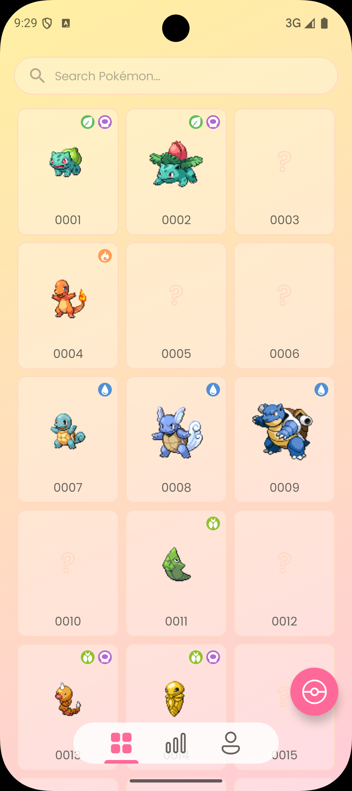
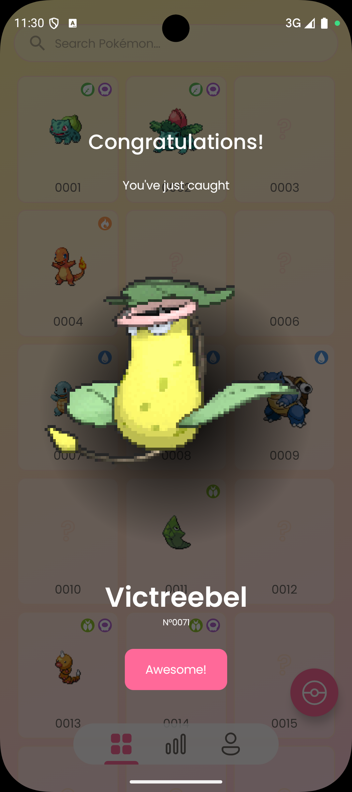

# Snapdex - Compose Edition

<a href="https://play.google.com/store/apps/details?id=com.kanoyatech.snapdex"></a>

_Check out [Snapdex – SwiftUI Edition](https://github.com/TimLariviere/Snapdex-SwiftUI) to see my SwiftUI development in action._

Snapdex is a production-quality **Pokédex-style app** built with Kotlin and Jetpack Compose. Users can snap pictures of Pokemon merch found in the wild (plushes, trading cards, etc) to complete their own Pokédex thanks to AI-powered recognition (TensorFlow Lite and OpenAI). This project is designed to serve both as a **learning experience** and a **professional showcase** of modern Android development skills.

<p align="center">
  
  
  
  
  
</p>

<p align="center">
  
  
  
</p>

*Design by [Rui Zhang](https://www.linkedin.com/in/ruizhang77); Pokemon detail page heavily inspired by Figma design by [Junior Savaria](https://www.figma.com/community/file/1202971127473077147)*

[Architecture guide](ARCHITECTURE.md)

## 🚀 Features

- Capture photos of Pokemon merchandise with your device camera
- AI-powered Pokemon recognition using TensorFlow Lite on-device and OpenAI API
- Complete your personal Pokédex by finding Pokemon in the real world
- Offline-first architecture with cloud synchronization
- Material 3 design with custom theming

## 🛠️ Technical Highlights

### Core Technologies
- Kotlin 2.0
- Jetpack Compose
- Gradle with Kotlin DSL

### Architecture & Design Patterns
- MVI Architecture: Unidirectional data flow for predictable state management
- Repository Pattern
- DAO Pattern
- Koin: Lightweight dependency injection framework for Kotlin

### Networking & Data
- Ktor: Kotlin-first HTTP client
- Room: Local database with offline-first approach
- Firebase Firestore: Cloud data synchronization
- Kotlinx Serialization: Kotlin-native JSON parsing
- DataStore: Modern replacement for SharedPreferences

### Authentication & Security
- Firebase Authentication
- Cryptography: Secure encrypted storage for OpenAI API keys

### Image Processing
- TensorFlow Lite: On-device Pokemon recognition
- OpenAI API: Cloud-based recognition for improved accuracy
- Coil: Kotlin-first image loading library with Compose support

### Analytics & Monitoring
- Firebase Analytics
- Firebase Crashlytics
- Firebase App Distribution: Beta testing and deployment

## 📱 How to Build

1. Run `dotnet fsi Init.fsx` to seed the database and download the Pokemon assets used by the app
2. Generate a keystore file to sign the app
3. Create `signing.properties` with the following properties:
   ```
   storeFile=<Relative path to the generated keystore file>
   storePassword=<Password of the keystore file>
   keyAlias=<Alias of the key>
   keyPassword=<Password of the key>
   ```
4. Create a Firebase project on the [Firebase Console](https://console.firebase.google.com/)
5. Configure the Firebase project for Android (Auth, Firestore, Analytics, Crashlytics)
6. Download `google-services.json` from Firebase and paste it to `app/google-services.json`
7. Run `./gradlew buildAllRelease` to generate the APK/AAB

## 📄 License

This project is licensed under the Apache 2.0 License - see the LICENSE file for details.
